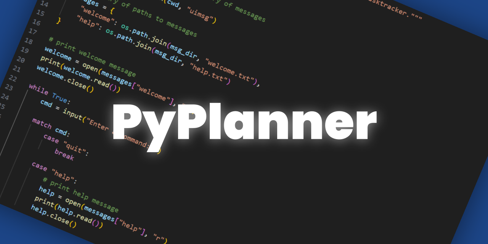

# ⏰ All My Time Is Free (WIP)
All My Time Is Free is a to-do list, planner, and task tracking system created in Python.
It is a CLI (command line interface) and does not have a GUI, although I may create one in the future.

## The Story
I started developing this project because I have a physical planner that I carry around.  It's been really useful, but I noticed that I repeated writing certain tasks over and over again (procrastination ._.) and I might accidentally forget them.

At around the same time, I wanted to work on coding a "serious" Python project that was actually useful to me.  Out of this, a little project I called "PyPlanner" was born.

I had doubts about the name, however, especially as it seemed too generic.  Later, I attended a talk where I heard Pope John Paul II's quote, "All my time is free."  I really liked this quote because it reminded me that everything in my schedule was my choice, and I have the free will to do what I want with my time.

## To Do
    [X] write to task files
    [X] directories to group tasks
    [ ] be able to create tasks through the CLI
    [ ] be able to get a list of tasks through the CLI
    [ ] email reminders

## Contributing
Will add to this section later.
